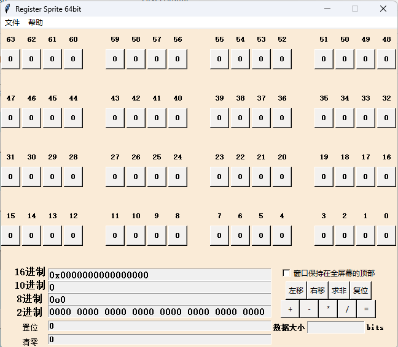

```shell script
         ____            _     _              ____             _ _
        |  _ \ ___  __ _(_)___| |_ ___ _ __  / ___| _ __  _ __(_) |_ ___
        | |_) / _ \/ _` | / __| __/ _ \ '__| \___ \| '_ \| '__| | __/ _ \
        |  _ <  __/ (_| | \__ \ ||  __/ |     ___) | |_) | |  | | ||  __/
        |_| \_\___|\__, |_|___/\__\___|_|    |____/| .__/|_|  |_|\__\___|
                   |___/                           |_|
```

[](https://github.com/Robin329/register_sprite_64bit/blob/master/LICENSE)
[](https://GitHub.com/Robin329/register_sprite_64bit/graphs/contributors/)
[](https://GitHub.com/Robin329/register_sprite_64bit/issues/)
[](https://GitHub.com/Robin329/register_sprite_64bit/pulls/)
[](http://makeapullrequest.com)

[](https://GitHub.com/Robin329/register_sprite_64bit/watchers/)
[](https://GitHub.com/Robin329/register_sprite_64bit/network/)
[](https://GitHub.com/Robin329/register_sprite_64bit/stargazers/)

[](README.en.md)


# **寄存器小精灵**



寄存器小精灵（Register Sprite 64bit）基于**python tkinter**编写，具有良好的界面和一些简单的交互功能，它可以轻松实现**10进制**、**16进制**、**8进制**和**2进制**之间的转换，可视化配置各种芯片的寄存器，嵌入式工程师的**必备神器**。
我提供了使用**pyinstaller**构建好的可执行文件，当然你也可以**修改后**构建自己的EXE文件。

> 如果你有更好的构建方法，欢迎指教！

安装教程
----

* 设备中已有Python环境

    > 通过本地python解释器直接运行main.py文件
    >
    > `python main.py `

* 设备中未安装Python环境

    > 作者提供了位于bin目录下构建好的exe文件

手动打包项目为exe文件
----
```shell
#未安装pyinstaller先执行安装
pip install pyinstaller

#pyinstaller 打包项目为exe文件
pyinstaller -F main.py -w
#更多构建操作查看pyinstaller help说明
```


使用说明
----
----
### 通过点击寄存器位按钮，更新底部各进制输入框中的数据，反之亦然。
> 暂时仅支持修改16进制输入框中的数据更新寄存器位按钮，待输入完成后点击回车刷新

保持更新
----

```shell
git pull origin
```

注意事项
----
> 1. 程序中存在debug函数，禁用后会提升程序运行效率
>
> 2. 程序首次运行会在根目录下生成配置文件，移动配置文件位置会导致保存的设置失效
>
> 3. 部分Linux发行版会出现中文编码问题，请尝试修改地区设置和安装中文字库，若上述方法依旧无法启动，尝试修改程序中文显示内容为英文。

软件架构
----
* Python 3.9 tkinter

  > 详情见文档目录

目录结构及说明
```shell
----
├── build		*----------可执行文件(最初版本)*
│   └── main.exe
├── doc		*----------软件文档目录*
│   ├── 更详细的软件结构说明.txt
│   └── 更新日志.txt
│   └── ...
├── lib		*----------库文件*
│   ├── __init__.py
│   ├── _debug.py		*----------调试库*
│   └── _color_operations.py		*----------样式库*
│   └── _file_operations.py		*----------文件操作库*
├── LICENSE		*----------许可证信息*
├── main.py		*----------主程序*
├── README.en.md	*----------README for english*
├── README.md	*----------README*
├── user-config.ini	  *----------用户配置文件*
├── run.bat	  *----------batch启动文件*
├── run.sh	  *----------shell启动文件*
└── src		*-----------资源目录*

*5 directories, 13 files*
```
使用到的库
-----
```python
# main.py
import ctypes
import os
from tkinter import *
import tkinter as tk

# _debug.py
import time
from functools import wraps

# _file_operations.py
import configparser

# _color_operations.py
import tkinter as tk
from tkinter import Tk, Label, Button, Toplevel
```

使用说明
----
* > 软件使用了可视化的操作界面，如果需要更详细的了解使用方法，请查看doc目录下相关文档

参与贡献
----
* > 如果你对于这个项目有任何想法，请务必告诉我
  >
  > 你的每一份贡献都是对这个项目极大的帮助


@[Robin329](https://github.com/Robin329/)
我的个人邮箱（jiangrenbin329@gmail.com）
